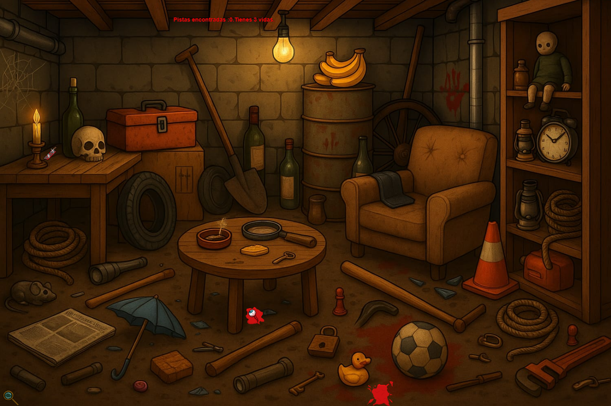
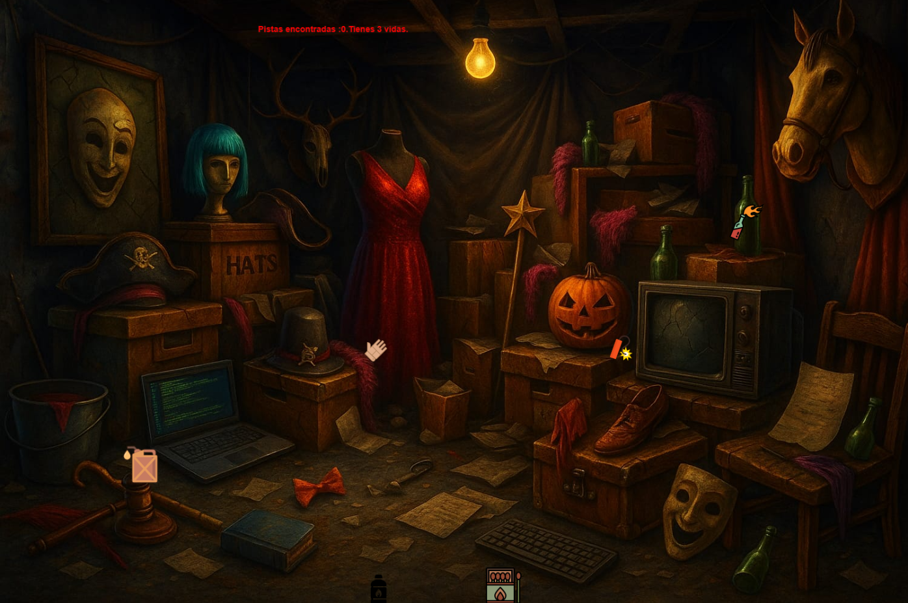

# Psychopath's Clues

## Equipo de desarrollo

- David Acosta.
- Rodrigo Alarcón.  
- Sebastian Arnez.
- Carlos Genisetto.
- Camila Montalbano.

## Capturas

 

## Reglas de Juego / Instrucciones

### Objetivo del Juego:
El objetivo del juego es hacer de detective y recoger todas las pistas esparcidas por la escena del crímen para así cerrar dicho caso y pasar al siguiente.

### Reglas Generales:
- El jugador cuenta con 3 vidas por nivel.
- Las pistas son recolectables. Éstas pueden ser las siguientes:
    - Sangre
    - Veneno
    - Nota
    - Huella
    - Fosforos
    - Kerosene
    - Nafta
    - Ojo
    - Dinamita
    - Molotov
    - Cuchillo
- Existen 2 tipos de pistas:
    - Pistas Comunes: Pueden ser recogidas con la lupa.  
    - Pistas peligrosas: Para recolectar las mismas se necesitan guantes.
        
- Aclaración: Si se intenta recoger una pista peligrosa sin los guantes, se restará una vida; más si se intenta recoger una pista común con los guantes, no se le restará vida al jugador, pero sí será incapaz de agarrar dicha pista con el guante puesto.

### Controles:
- Para moverse a través de la escena del crimen el jugador podrá usar las flechitas (arriba, abajo, izquierda y derecha). 
- Como cualquier buen detective el jugador también podrás utilizar los guantes (presionando la tecla "G") o utilizar la lupa (presionando la tecla "L"). 
- Controles secretos: Con "V" serás capaz de poner la música al 0%, con "B" la música al 25%, con "N" al 50%, y con "M" al 100% de nuevo, en caso de que te canses de escucharla/quieras escucharla de nuevo.

## Otros

- Programación con objetos 1 - Universidad Nacional de Hurlingham.
- Versión de wollok: 0.3.1.
- Una vez terminado, no tenemos problemas en que el repositorio sea público.
